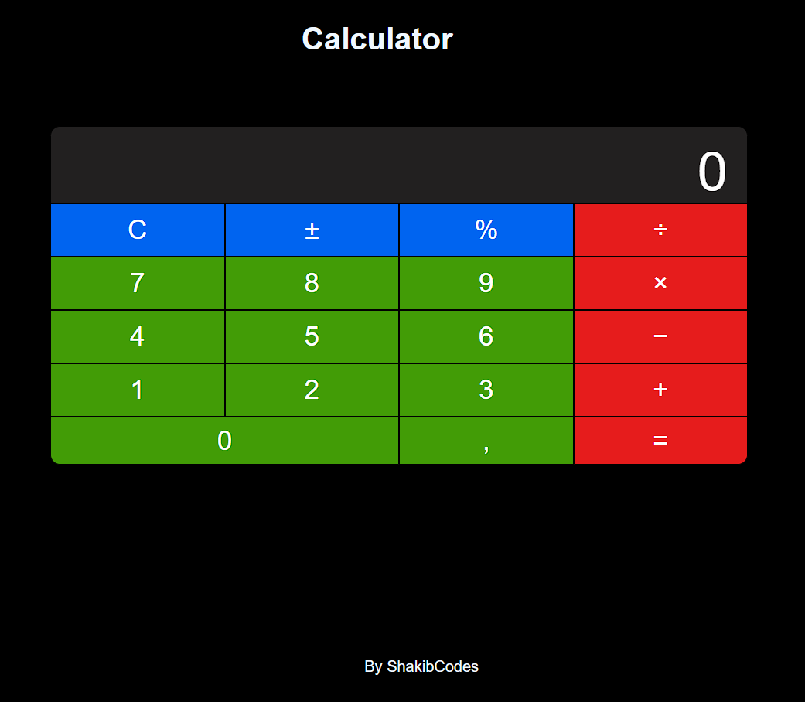

# Smart Calculator

**Hey, it's me [ShakibCodes](https://github.com/ShakibCodes)!**   

##  Overview
Smart Calc is a sleek and modern calculator built using HTML, CSS, and JavaScript. It provides basic arithmetic operations with an intuitive UI and smooth button animations.

##  Features
- Clean and responsive design
- Hover and press effects for buttons
- Basic arithmetic operations (+, -, *, /, %)
- Smooth animations and transitions
- Lightweight and fast

##  Screenshot


##  Installation & Usage
1. **Clone the repository:**
   ```sh
   git clone https://github.com/your-username/smart-calc.git
   ```
2. **Navigate to the project folder:**
   ```sh
   cd smart-calc
   ```
3. **Open `index.html` in your browser**

##  Tech Stack
- **HTML** - Structure
- **CSS** - Styling & animations
- **JavaScript** - Functionality

##  Live Demo
[View Smart Calc Online](https://ShakibCodes.github.io/smart-calc/)

##  Contributing
Feel free to fork this project, make improvements, and submit a pull request!

##  License
This project is open-source and available under the [MIT License](LICENSE).

